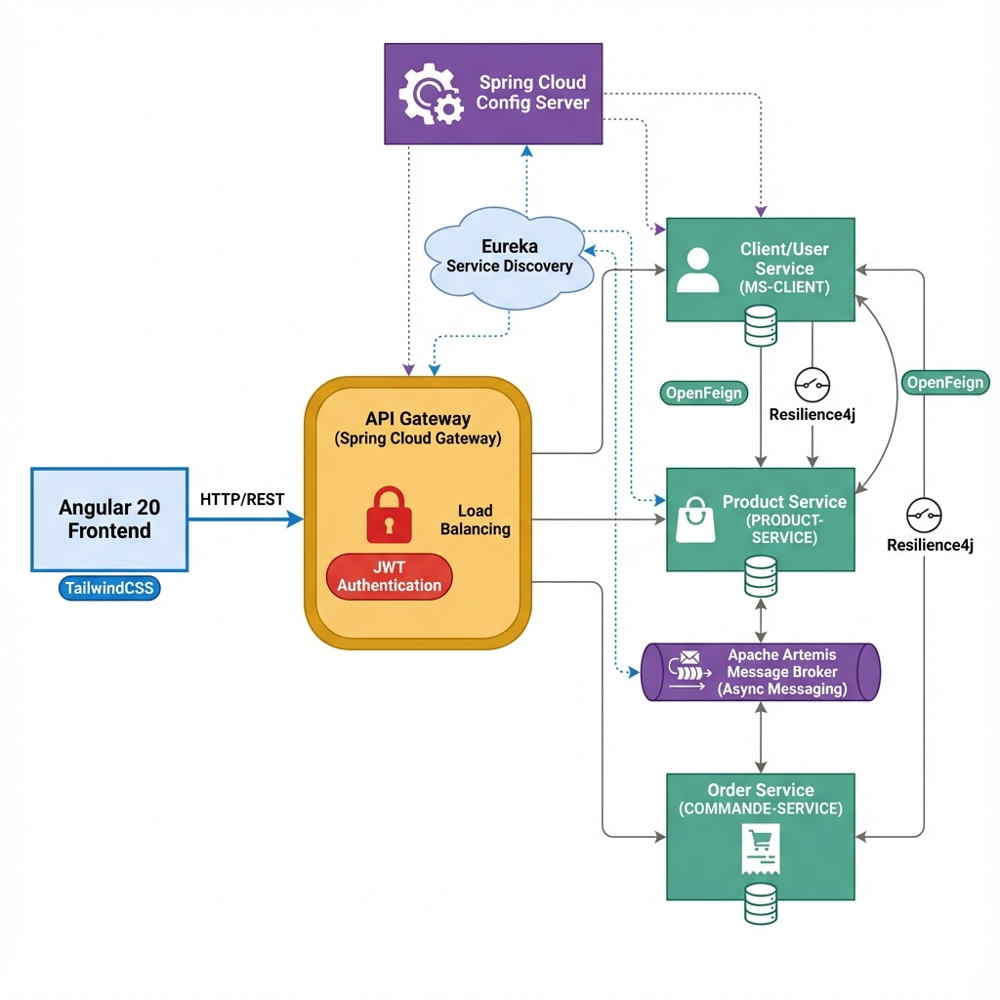
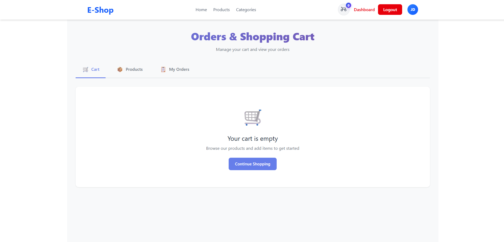

# 🛒 E-Commerce Microservices Platform

A full-stack e-commerce application built with **Angular 20** and **Spring Boot Microservices**.

> It's not about fancy interfaces or complex backend functionalities — it's about **microservices** 😄

## 👥 Team

- **Ilias Wakkar**
- **Rayene Fennane**

---

## 🏗️ Architecture



### Microservices

| Service | Port | Description |
|---------|------|-------------|
| **API Gateway** | 1111 | Routing, JWT Auth, Load Balancing |
| **MS-CLIENT** | 8081 | User management & profiles |
| **PRODUCT-SERVICE** | 8082 | Products & categories CRUD |
| **COMMANDE-SERVICE** | 8083 | Cart & order management |
| **Config Server** | 8888 | Centralized configuration |
| **Eureka Server** | 8761 | Service discovery |

---

## 🛠️ Tech Stack

### Frontend

- Angular 20
- TailwindCSS 4
- RxJS
- Server-Side Rendering (SSR)

### Backend

- Spring Boot 3
- Spring Cloud Gateway
- Spring Security + JWT
- OpenFeign (inter-service communication)
- Resilience4j (circuit breaker)
- Apache Artemis (message broker)
- Eureka (service discovery)
- Spring Cloud Config

### Database

- PostgreSQL / MySQL

---

## ✨ Features

### 🛍️ Customer Features

- Browse product catalog
- View product details
- Add to cart / manage cart
- Place orders
- View order history

### 👨‍💼 Admin Dashboard

- **Overview** — KPI metrics
- **Clients** — User management, role promotion
- **Products** — Full CRUD operations
- **Orders** — View & update order status
- **Profile** — Admin settings

### 🔐 Security

- JWT-based authentication
- Role-based access (USER / ADMIN)
- Protected routes with guards

---

## 📸 Screenshots

### 🏠 Home Page


### 🛒 Shopping Cart



### 📦 Product Details


### 📊 Admin Dashboard


---

## 🚀 Getting Started

### Prerequisites

- Node.js 18+
- npm or yarn
- Backend microservices running

### Installation

```bash
# Clone the repository
git clone https://github.com/your-repo/e-commerce-frontend.git

# Navigate to project
cd E-commerce_front-end

# Install dependencies
npm install

# Start development server
npm start
```

The app will be available at `http://localhost:4200`

### Environment

The frontend connects to the API Gateway at `http://localhost:1111`. Configure this in:

- `src/environments/environment.ts`

---

## 📁 Project Structure

```
src/app/
├── services/          # API services (auth, product, cart, order)
├── guards/            # Route guards (auth, admin)
├── components/        # Reusable UI components
├── pages/             # Page components
│   ├── home/          # Product showcase
│   ├── product-detail/
│   └── admin/         # Admin dashboard
├── login/             # Authentication pages
├── register/
└── auth.interceptor.ts
```

---

## 📡 API Endpoints

### Auth

```
POST /auth/login      → Login
POST /auth/register   → Register
```

### Products

```
GET    /PRODUCT-SERVICE/products     → List all
GET    /PRODUCT-SERVICE/products/:id → Get one
POST   /PRODUCT-SERVICE/products     → Create
PUT    /PRODUCT-SERVICE/products/:id → Update
DELETE /PRODUCT-SERVICE/products/:id → Delete
```

### Cart & Orders

```
GET    /COMMANDE-SERVICE/api/cart        → Get cart
POST   /COMMANDE-SERVICE/api/cart/items  → Add item
DELETE /COMMANDE-SERVICE/api/cart/items/:id → Remove
POST   /COMMANDE-SERVICE/api/orders      → Place order
GET    /COMMANDE-SERVICE/api/orders      → Order history
```

---

## 📝 License

This project was built for educational purposes as part of JEE2 coursework at EMSI.

---

## 🙏 Acknowledgments

Special thanks to **Rayene Fennane** for the amazing collaboration on this project!
